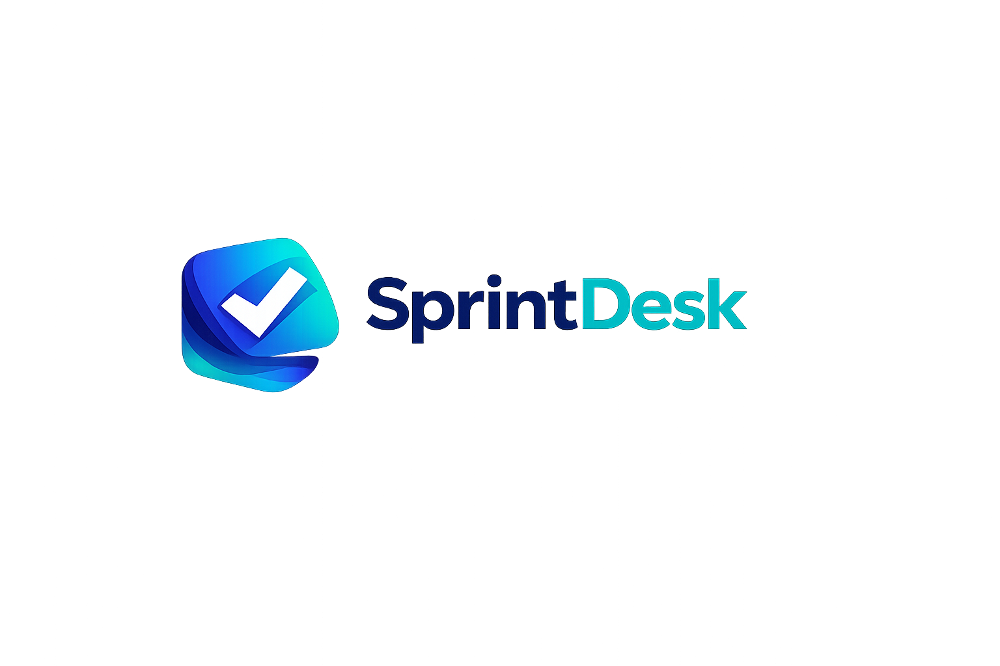

# SprintDesk



SprintDesk is a multi-tenant issue tracker + knowledge base focused on crisp, editor-grade UI and team workflows. The repo is built in phased commits, keeping each stage runnable.

## What it does

- Workspaces with role-based access (owner/admin/member/viewer)
- Issues with comments, assignees, priorities, and realtime updates
- Knowledge base articles with markdown preview and linked issues
- Notifications for assignments and mentions
- Auth with JWT access + refresh rotation, Google sign-in, email OTP, and demo mode

## Tech stack

- Frontend: React + TypeScript (Vite), Tailwind CSS, Radix UI, Lucide icons
- Backend: Java 17 + Spring Boot (Web, Validation, Security)
- Database: PostgreSQL
- Realtime: WebSockets (STOMP)

## Quick Start (Docker)

```bash
docker compose up --build
```

- Frontend: http://localhost:5173
- Backend: http://localhost:8080/api/health

## Local Dev (No Docker)

```bash
cd backend
./mvnw spring-boot:run
```

```bash
cd frontend
npm install
npm run dev
```

## Environment

- `backend/.env.example`
- `frontend/.env.example`

Google login requires:
- Backend: `GOOGLE_CLIENT_ID`
- Frontend: `VITE_GOOGLE_CLIENT_ID`

OTP login (local/dev):
- Set `OTP_RETURN_CODE=true` to return the OTP in the response for testing.

## Demo Accounts (local)

Use these credentials after running the backend with the `local` profile:

- Owner: `demo_owner@demo.com` / `Demo@1234`
- Member: `demo_member@demo.com` / `Demo@1234`

You can reset demo data with:

```bash
curl -X POST http://localhost:8080/api/demo/reset
```

## shadcn/ui Setup

The frontend is pre-configured for shadcn/ui. To add components, run:

```bash
cd frontend
npx shadcn@latest add button card dialog sheet table tabs badge dropdown-menu input textarea separator skeleton
```

This uses the `components.json` already included in the repo.
